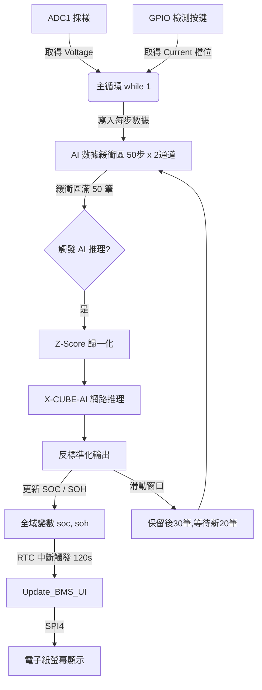

# STM32G474 Edge-AI 電池 SOC 估算與 BMS 模擬專案

本專案是一個基於 **STM32G474** 微控制器的邊緣運算（Edge AI）電池管理系統（BMS）模擬平台。專案整合了 **STMicroelectronics X-CUBE-AI** 框架，透過已部署的神經網路模型，基於時間序列的電池電壓與電流輸入，即時預測電池的 **SOC（State of Charge，充電狀態）**，並將結果即時顯示於電子紙顯示器（E-Paper Display, EPD）以及透過 UART 輸出調試訊息。

---

## 📌 系統架構與資料流

本專案採用了「**最小侵入式/隔離式**」的代碼整合設計。所有的 AI 推理、緩衝區管理與歸一化運算均被封裝在 `X-CUBE-AI/App/app_x-cube-ai.c` 中，保持 `Core/Src/main.c`（由 STM32CubeMX 自動生成）的乾淨與完整性。



---

## 🔌 硬體資源與引腳配置 (Pin Definitions)

以下為 STM32G474 晶片的硬體週邊與引腳映射關係，此配置已在 `123.ioc` 中完成：

### 1. 輸出與顯示週邊 (SPI4)
E-Paper 電子紙螢幕使用 **SPI4** 進行驅動，相關控制引腳如下：

| 引腳名稱 | 晶片引腳 (GPIO) | 模式 | 用途說明 |
| :--- | :--- | :--- | :--- |
| **BUSY** | GPIOB - PIN 10 | Input | 檢測電子紙忙碌狀態 |
| **RST** | GPIOB - PIN 11 | Output (PP) | 電子紙硬體重置引腳 |
| **DC** | GPIOB - PIN 12 | Output (PP) | 資料/指令選擇引腳 (Data/Command) |
| **CS** | GPIOB - PIN 13 | Output (PP) | SPI 片選引腳 (Chip Select) |

### 2. 模擬負載與狀態輸入 (GPIO & DAC)
本專案使用 GPIO 偵測不同的輸入開關狀態，藉此模擬電池在不同工作狀態下的放電電流（`Curr[0]`），並同步輸出對應的 **DAC1 Channel 2** 電壓來進行負載模擬：

| 輸入引腳 | 晶片引腳 (GPIO) | 檢測檔位 | 模擬電流 (`Curr[0]`) | DAC 輸出值 | 模擬狀態 |
| :--- | :--- | :--- | :--- | :--- | :--- |
| **low_Pin** | GPIOB - PIN 14 | 高電平 (SET) | `-2.7375 A` | 3071 (~2.4V) | 高負載放電 |
| **mid_Pin** | GPIOD - PIN 8 | 高電平 (SET) | `-1.4200 A` | 2047 (~1.6V) | 中負載放電 |
| **high_Pin** | GPIOD - PIN 9 | 高電平 (SET) | `-0.9125 A` | 1024 (~0.8V) | 低負載放電 |
| **ex_Pin_Pin** | GPIOC - PIN 8 | 高電平 (SET) | `-3.6500 A` | 4095 (~3.2V) | 極高負載放電 |
| **ReadBatteryStatus_Pin** | GPIOD - PIN 14 | 高電平 (SET) | `-0.0100 A` | 200 (~0.15V) | 待機/極低消耗 |
| **ONOFF_Pin** | GPIOB - PIN 15 | 高電平 (SET) | - | 關閉 (0) | 電子紙睡眠並關閉輸出 |

*   **電池電壓採樣 (ADC1 Channel 1)**: 電池電壓 `voltage` 藉由 ADC1 讀取並轉換：
    $$\text{voltage} = \frac{\text{adc\_value}}{4095.0} \times 3.22 \times 2.07$$
    若 `voltage < 2.70V`，系統將關閉 DAC 輸出並進入低壓保護死循環。

---

## 🧠 AI 推理與數據處理機制

神經網路模型要求固定的輸入序列格式，且數據必須與訓練時的分布一致（Z-Score 歸一化）。

### 1. 歸一化參數
系統內嵌以下歸一化參數，對採樣的原始數據進行即時轉換：

*   **輸入特徵 (Voltage, Current)**:
    *   $\mu_{\text{voltage}} = 3.5970976$ , $\sigma_{\text{voltage}} = 0.2873368$
    *   $\mu_{\text{current}} = -1.4133143$ , $\sigma_{\text{current}} = 0.0047073$
*   **輸出預測 (SOC)**:
    *   $\mu_{\text{soc}} = 50.304035$ , $\sigma_{\text{soc}} = 28.806041$

### 2. 滑動窗口緩衝機制 (Sliding Window)
神經網路模型的輸入維度為 **(50, 2)**，代表需要持續 50 個時間步的（電壓, 電流）數據。

1.  **冷啟動階段**:
    *   系統啟動後，每次在主循環中讀取到新的電壓與電流，即填入 `data_buf` 中。
    *   當 `data_count` 達到 **50** 筆時，將 50 筆數據進行標準化，並觸發首次 AI 推理。
2.  **滑動窗口階段**:
    *   推理完成後，丟棄最舊的 **20 筆** 數據，將後面的 **30 筆** 數據往前移動（即 `data_buf[0..29] = data_buf[20..49]`）。
    *   此時緩衝區有效數據量變回 **30 筆**。
    *   後續只需要再採集 **20 筆** 新數據（使計數重新達到 50），即可再次觸發下一次推理。
    *   這確保了在首輪等待後，每 20 次採樣週期就能更新一次 SOC 估計。

---

## ⚙️ 核心調試與參數修改

若您希望在重現時修改系統的運行節奏，可以參考以下兩個主要配置：

### 1. 調整電子紙 UI 的更新頻率
電子紙的刷新時間較長（通常為數秒），因此不能频繁重新繪製。更新頻率由 RTC 的 WakeUp 中斷決定：
在 `Core/Src/main.c` 的 `MX_RTC_Init()` 函數中：
```c
// 當前配置為 120 秒更新一次電子紙螢幕
if (HAL_RTCEx_SetWakeUpTimer_IT(&hrtc, 120, RTC_WAKEUPCLOCK_CK_SPRE_16BITS) != HAL_OK)
```
*   **調試建議**: 若需快速檢視畫面更新效果，可將 `120` 改為 `2` 或 `5` 秒。

### 2. 調整 AI 的採樣間隔與延遲
目前 `MX_X_CUBE_AI_Process()` 是在 `main()` 的 `while(1)` 循環中無延遲調用。如果需要將採樣週期固定（例如每 1 秒採樣一次）：
可以在 `while(1)` 的尾端加上 `HAL_Delay(1000)`，或是將採樣/緩衝邏輯移至 RTC 或定時器中斷中。

---

## 🛠️ 重現與編譯指南

本專案使用 **CMake** 與 **arm-none-eabi-gcc** 工具鏈進行建置。

### 1. 環境準備
請確保您的系統已安裝以下工具並加入環境變數（PATH）：
1.  **CMake** (3.22 以上)
2.  **Ninja** 或 **Make**
3.  **GNU Arm Embedded Toolchain** (`arm-none-eabi-gcc`)
4.  （選用）**STM32CubeProgrammer** 用於燒錄

### 2. 編譯步驟 (Windows Powershell 範例)

本專案已配置好 `CMakePresets.json`，您可以使用預設命令快速完成編譯：

#### 偵錯模式 (Debug)
```powershell
# 1. 配置專案 (產生 build/Debug 資料夾)
cmake --preset Debug

# 2. 執行編譯
cmake --build build/Debug
```

#### 發行模式 (Release)
```powershell
# 1. 配置專案 (產生 build/Release 資料夾)
cmake --preset Release

# 2. 執行編譯
cmake --build build/Release
```

編譯完成後，二進位檔案（`.elf`, `.hex`, `.bin`, `.map`）將會生成在 `build/Debug/` 或 `build/Release/` 底下。

---

## 📂 專案重要目錄結構說明

```text
├── .settings/              # 開發環境 IDE 相關設定
├── Core/
│   ├── Inc/
│   │   ├── main.h          # 全域引腳宏定義與函數聲明
│   │   └── epd_driver.h    # 電子紙驅動標頭檔
│   └── Src/
│       ├── main.c          # 系統主入口、週邊初始化與主循環
│       ├── GUI.c           # 電子紙畫布與繪圖函式庫
│       ├── epd_driver.c    # 電子紙低階 SPI 驅動實現
│       └── epd_images.c    # 靜態影像資源
├── Drivers/                # ST 提供的 HAL 驅動庫與 CMSIS 底層庫
├── Middlewares/
│   └── ST/
│       └── AI/             # X-CUBE-AI 靜態運行庫 (核心推理引擎)
├── X-CUBE-AI/
│   ├── App/
│   │   ├── app_x-cube-ai.c # AI 推理主流程 (緩衝/歸一化/滑動窗口核心)
│   │   ├── network.c       # 神經網絡結構定義 (C編譯代碼)
│   │   └── network_data_params.c  # 固化在 Flash 中的神經網路權重參數 (約 730KB)
│   └── constants_ai.h      # AI 相關常數
├── cmake/
│   ├── gcc-arm-none-eabi.cmake  # 交叉編譯編譯器設定與編譯參數
│   └── stm32cubemx/        # CMake 自動產生的原始碼編譯配置列表
├── 123.ioc                 # STM32CubeMX 原始專案檔 (可直接雙擊打開修改 Pinout)
├── CMakeLists.txt          # 專案根目錄 CMake 腳本
└── CMakePresets.json       # CMake 預設配置方案檔
```

---

## 🧪 運行與驗證

1.  **燒錄固件**: 使用 ST-Link 或 J-Link 將 `build/Debug/123.elf` 燒錄至 STM32G474 開發板。
2.  **連接 UART 偵錯器**: 將開發板的 TX1 (PA9/PA2，請參考板子硬體電路圖) 連接至 PC，打開串口助手（Baudrate: `115200`）。
3.  **串口輸出驗證**:
    *   啟動後，將看到 `=== UART INITIALIZED ===`。
    *   隨後在數據採樣階段，每一步會輸出如下訊息：
        `[Step  1] V=3.61V, I=-2.73A, SOC=0%`
    *   當累積到第 50 步時，將執行 AI 推理並輸出結果：
        ```text
        ====== AI INFERENCE RESULT ======
        [AI] SOC = 50 % (Raw=0.01)
        =================================
        ```
    *   隨後，緩衝區滑動，計數變為 30。後續每經過 20 步採樣，就會重新觸發一次推理。
4.  **螢幕顯示驗證**: 電子紙會每 120 秒（由 RTC 中斷控制）重新整理，顯示當前電壓（V）與 AI 預測之 SOC 值。
